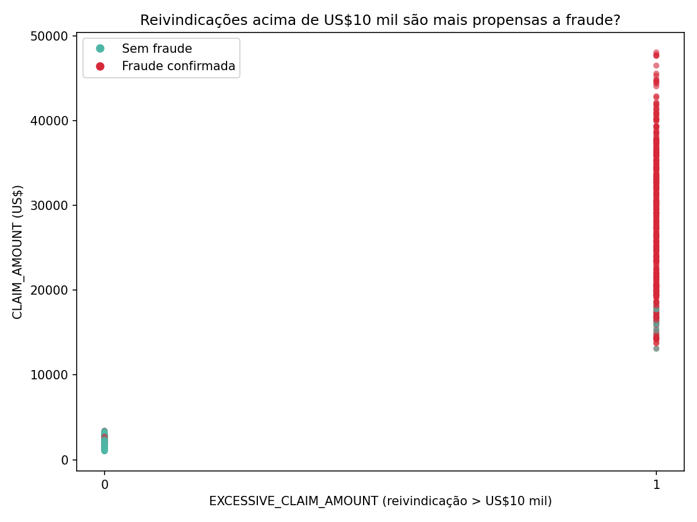

# Previsão de Fraude em Seguros de Automóveis — Limpeza e Exploração de Dados

Projeto prático do curso **Data Fundamentals (IBM)**, focado na etapa de **limpeza e
exploração de dados** — a base de qualquer projeto de ciência de dados — usando o
**IBM Watson Studio** (Data Refinery) e, neste repositório, reproduzido em **Python/pandas**
para fins de portfólio.

## Contexto do negócio

Uma seguradora de automóveis quer prever quais reivindicações têm maior chance de
ser **fraudulentas**. O dataset original contém 38 colunas com dados de reivindicações
já aprovadas e pagas, incluindo uma coluna com o veredito de investigadores de fraude
(`FLAG_FOR_FRAUD_INV`), usada como variável-alvo para um futuro modelo supervisionado.

## O que foi feito

### 1. Limpeza de dados (IBM Watson Studio → Data Refinery)

| Ação | Colunas | Motivo |
|---|---|---|
| 🗑️ Removidas | `HOUSEHOLD_ID`, `DRIVER_ID`, `POLICY_ID`, `CLAIM_ID`, `PRIMARY_DRIVER_ID` | Identificadores únicos — sem poder preditivo |
| 🔒 Removidas | `FIRST_NAME`, `LAST_NAME` | Dados pessoais (PI) — não ajudam a prever fraude e trazem risco de privacidade |
| 🗑️ Removida | `DESCRIPTION` | Coluna vazia, sem informação |
| 🛠️ Corrigido tipo | `LOSS_EVENT_TIME` | Estava como texto (string) → convertida para data |
| ✅ Mantidas | `INCIDENT_CAUSE`, `CLAIM_STATUS`, `CLAIM_AMOUNT`, `ODOMETER_AT_LOSS`, `POLICE_REPORT`, `LOSS_EVENT_TIME`, `CLAIM_INIT_TIME`, `FLAG_FOR_FRAUD_INV`, entre outras | Variáveis com desvio padrão relevante (dispersão = padrão potencial) e/ou diretamente ligadas à hipótese de negócio |

Resultado: o dataset foi reduzido de **38 para 19 colunas**, mantendo apenas variáveis
com real potencial preditivo.

### 2. Engenharia de variável + teste de hipótese

O time de negócio levantou uma hipótese: *reivindicações acima de US$10 mil têm
mais chance de ser fraude*. Para testar isso, foi criada a coluna derivada:

```python
df["EXCESSIVE_CLAIM_AMOUNT"] = (df["CLAIM_AMOUNT"] > 10_000).astype(int)
```

### 3. Visualização

Um gráfico de dispersão cruzando `EXCESSIVE_CLAIM_AMOUNT` (eixo X) com `CLAIM_AMOUNT`
(eixo Y), colorido pela variável-alvo `FLAG_FOR_FRAUD_INV`, revelou:



- **Taxa de fraude abaixo de US$10 mil: 5,3%**
- **Taxa de fraude acima de US$10 mil: 95,2%**

A hipótese se confirma na maior parte dos casos — mas não é absoluta: existem
fraudes com valores baixos e reivindicações altas que não são fraude. Ou seja,
o valor da reivindicação sozinho não é um preditor perfeito, mas é um sinal forte.

## Como rodar

```bash
git clone <url-do-seu-repo>
cd auto-insurance-fraud-data-cleaning
pip install -r requirements.txt
python src/explore_fraud_data.py
```

## Estrutura do repositório

```
.
├── data/
│   └── AutoInsClaims_csv_shaped_shaped.csv   # dataset após limpeza no Watson Studio
├── images/
│   └── scatter_claim_vs_fraud.png            # gráfico gerado pelo script
├── src/
│   └── explore_fraud_data.py                 # reproduz a lógica de limpeza + visualização
├── requirements.txt
└── README.md
```

## Ferramentas

- **IBM Watson Studio** (Data Refinery) — limpeza, perfilamento e visualização interativa dos dados
- **Python** (pandas, matplotlib) — reprodução da análise para este repositório

## Próximos passos

- [ ] Treinar um modelo supervisionado (ex: regressão logística ou árvore de decisão) usando `FLAG_FOR_FRAUD_INV` como alvo
- [ ] Avaliar outras variáveis (ex: `INCIDENT_CAUSE`, `POLICE_REPORT`) como preditores
- [ ] Comparar métricas de performance do modelo

---

Projeto desenvolvido como parte do curso **Data Fundamentals** da IBM.
